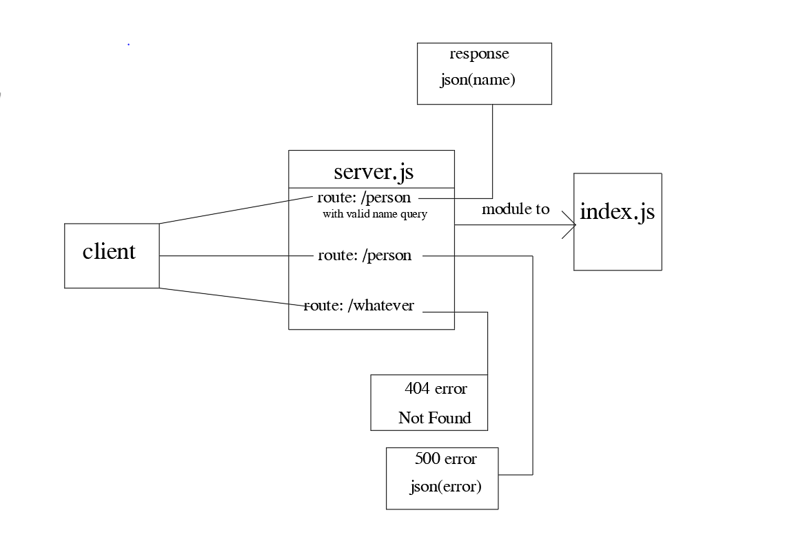

# basic-express-server
## Author: *Abdalrhman Albdahat*

## links:
[Heroku](https://boodah96-basic-express-server.herokuapp.com/)
[GitHub Repo](https://github.com/boodah96/basic-express-server)
[PR](https://github.com/boodah96/basic-express-server/pull/1)

### Start work with this commands:
`npm init -y`
```npm i express dotenv ```
`npm i -D jest supertest`

### UML diagram:



